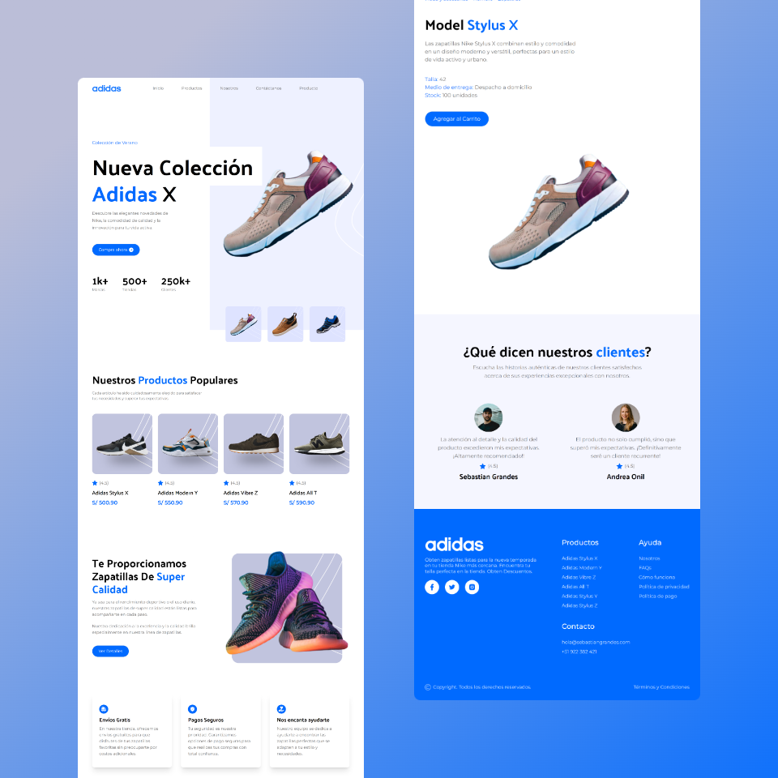

# 🚀 Adidas Landing Page con React

Este proyecto es una **Landing Page de Adidas** desarrollada utilizando **React**, **Tailwind CSS** y **Vite**. Representa un esfuerzo personal para profundizar en el aprendizaje y dominio de estas tecnologías, con especial énfasis en Tailwind CSS. 🌟

## ✨ Tecnologías Utilizadas

-   **Tailwind CSS**: Empleado para el diseño y estilización eficiente de la página.
-   **React**: Utilizado para la construcción de una interfaz de usuario interactiva.
-   **Vite**: Elegido como herramienta de construcción y desarrollo rápido.

## 🌐 Despliegue

El proyecto está activamente desplegado y listo para ser explorado en mi sitio web. ¡Echa un vistazo a la versión en vivo [aquí](https://sebastiangrandes.com/proyectos/adidas-landing-react/)!

### 🖼️ Mockup del Proyecto

Dale un vistazo al diseño de la landing page:

## 💡 Personalización y Adaptación

La guía original del proyecto estaba en inglés, y he logrado traducirla al español para una mejor comprensión y alcance. A diferencia del proyecto original, que era una landing page para Nike, personalicé el diseño para Adidas, cambiando colores y textos al español. Utilicé Illustrator para editar el logo y otros iconos, adecuándolos a la marca Adidas. **Además, innové añadiendo una página adicional dedicada exclusivamente a un producto, agregando valor y personalización única al proyecto.**

## 🙌 Agradecimientos

Un agradecimiento especial a [JavaScript Mastery](https://www.youtube.com/@javascriptmastery) por su valioso contenido educativo, que ha sido fundamental en mi aprendizaje de Tailwind CSS. Encuentra la guía original de construcción del proyecto en su video "[_Tailwind CSS Full Course 2023 | Build and Deploy a Nike Website_](https://youtu.be/tS7upsfuxmo)" en YouTube.
